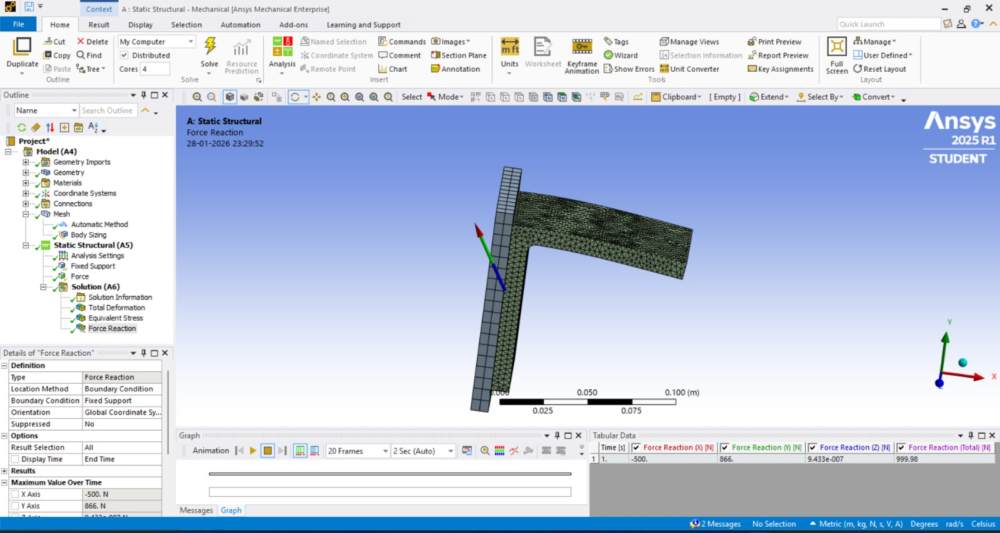
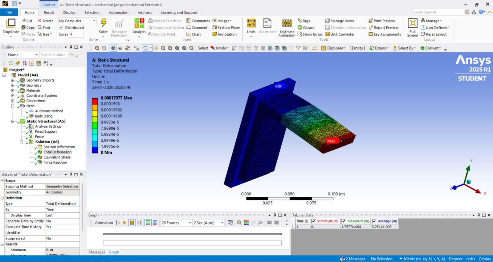
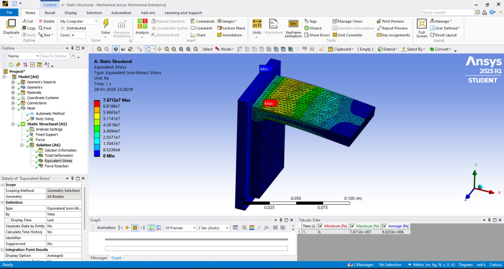
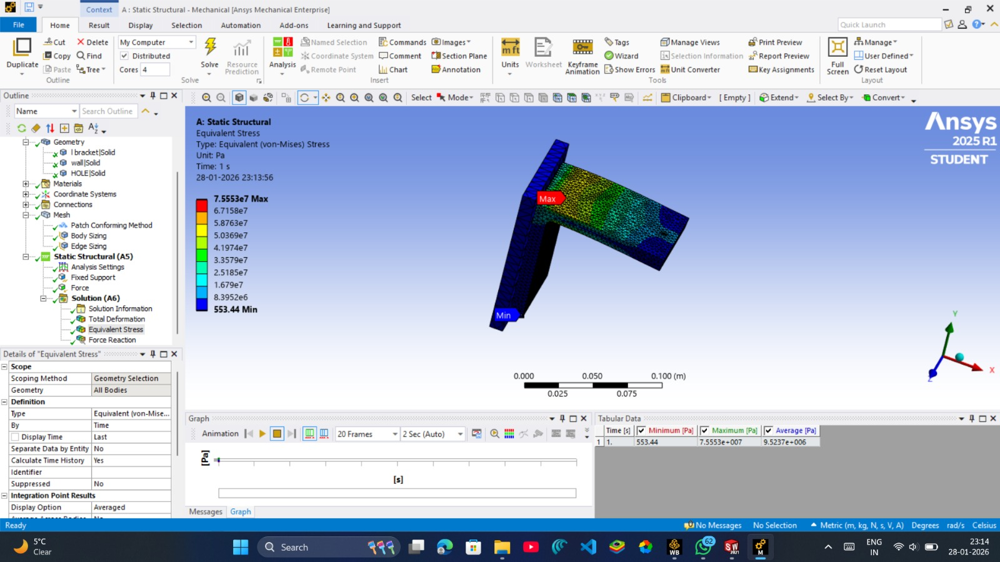

# Static Structural and Stress Singularity Analysis of a Bracket Using ANSYS

## Overview

This project presents a static structural finite element analysis of a
bracket using ANSYS Mechanical.

The study focuses on evaluating the structural response of the bracket under
a 1000 N resultant force and interpreting the resulting reaction forces,
deformation and equivalent von-Mises stress.

A stress investigation was also performed to distinguish between a physical
stress concentration at the inner fillet and a numerical stress singularity
at the sharp corners of the fixed support.

---

# Author

**Satyam Kumar**

B.Tech Mechanical Engineering  
Indian Institute of Technology Mandi

---

# Objective

The main objectives of this study are:

- Verify the applied force using reaction-force equilibrium
- Determine the total deformation of the bracket
- Evaluate the equivalent von-Mises stress
- Identify regions of high stress concentration
- Investigate stress behavior near the fixed support
- Distinguish physical stress concentration from numerical stress singularity
- Interpret the FEA results from an engineering perspective

---

# Analysis Type

| Parameter | Details |
|---|---|
| Analysis Type | Static Structural |
| FEA Software | ANSYS Mechanical |
| Component | Bracket |
| Resultant Applied Force | 1000 N |
| X-Component | +500 N |
| Y-Component | −866 N |
| Z-Component | 0 N |

---

# Applied Loading

The applied force was defined using Cartesian force components.

| Direction | Applied Force |
|---|---:|
| X | +500 N |
| Y | −866 N |
| Z | 0 N |

The resultant of these components is approximately 1000 N.

The reaction-force results obtained from ANSYS were then used to verify
whether the applied load was correctly transferred through the model.

---

# Force Balance Verification

The reaction forces obtained from the analysis were:

| Direction | Reaction Force |
|---|---:|
| X | −500 N |
| Y | +866 N |
| Z | Approximately 0 N |
| Total | 999.98 N |

The total reaction force is approximately equal to the applied force of
1000 N.

The reaction-force components are equal in magnitude and opposite in
direction to the applied force components.

This confirms that force equilibrium is satisfied and that the vector load
has been applied correctly.



---

# Total Deformation

The total deformation result obtained from ANSYS was:

**Maximum Total Deformation = 1.7977 × 10⁻⁴ m**

**Minimum Total Deformation = 0 m**

The maximum deformation occurs at the free end of the horizontal leg,
while the minimum deformation occurs at the fixed support.



The bracket undergoes combined axial stretching and bending.

The X-component of the force produces axial tensile deformation, while the
Y-component produces bending of the horizontal leg.

Since no force or moment is applied about the longitudinal axis, torsional
deformation is not significant.

---

# Equivalent Von-Mises Stress

Equivalent von-Mises stress was evaluated to study the stress distribution
within the bracket.

The maximum equivalent stress obtained at the investigated inner fillet
region was approximately:

**7.55 × 10⁷ Pa**



The high stress at the inner fillet is associated with the actual load
transfer and geometric stress concentration at the curved junction of the
bracket.

---

# Stress Singularity Investigation

A stress singularity investigation was performed to determine whether the
very high stress observed at different locations represented actual material
behavior or a numerical artifact.

## Location A — Inner Fillet

The inner fillet showed a high equivalent von-Mises stress.

This stress is associated with the actual load transfer and geometric stress
concentration at the curved junction of the bracket.

The stress at this region is therefore considered a real stress
concentration.

## Location B — Fixed Support Sharp Corners

Very high stress was observed at the sharp corners of the fixed support.

A mesh refinement to 0.5 mm caused the stress value at this location to
increase by more than 20%.

This behavior indicates a stress singularity.

The high stress at the sharp fixed-support corners is therefore considered a
numerical artifact caused by the idealized fixed boundary condition rather
than a direct representation of real material behavior.



---

# Engineering Interpretation

The analysis demonstrates that FEA results should be interpreted based on
the physical behavior of the structure rather than simply selecting the
largest numerical stress value.

The reaction-force results confirm that the applied load is correctly
represented in the model.

The deformation result shows that the bracket experiences combined axial
stretching and bending.

The stress results identify a meaningful stress concentration at the inner
fillet.

The investigation of the fixed-support region demonstrates the effect of an
idealized boundary condition and the resulting stress singularity.

---

# Analysis Workflow

```text
Problem Definition
        |
        v
Bracket Model
        |
        v
Material Definition
        |
        v
Mesh Generation
        |
        v
Boundary Conditions
        |
        v
Applied Vector Force
        |
        v
Static Structural Solution
        |
        v
Reaction Force Verification
        |
        v
Total Deformation
        |
        v
Equivalent Stress
        |
        v
Stress Singularity Investigation
        |
        v
Engineering Interpretation
